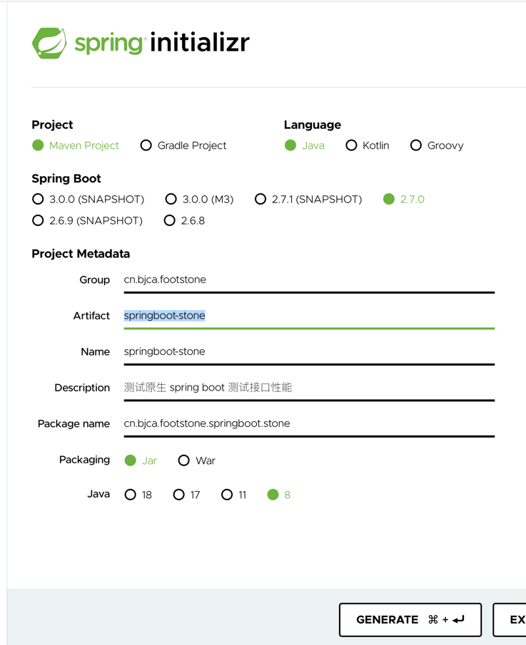

## 创建 springboot 测试工程步骤

### 进入 `https://start.spring.io/`

[https://start.spring.io/](https://start.spring.io/)

### 输入项目信息

输入项目信息后，点击`GENERATE`生成并下载项目（zip）



### 修改 `spring-boot` 版本号

修改版本号和脚手架所使用的 spring-boot 一致

```xml

<parent>
  <groupId>org.springframework.boot</groupId>
  <artifactId>spring-boot-starter-parent</artifactId>
  <version>2.7.0</version>
  <relativePath/> <!-- lookup parent from repository -->
</parent>
```

<center>&darr;&darr;&darr;</center>

```xml

<parent>
  <groupId>org.springframework.boot</groupId>
  <artifactId>spring-boot-starter-parent</artifactId>
  <version>>1.5.22.RELEASE</version>
  <relativePath/> <!-- lookup parent from repository -->
</parent>
```

### 引入 spring-boot-starter-web

```xml

<dependency>
  <groupId>org.springframework.boot</groupId>
  <artifactId>spring-boot-starter-web</artifactId>
</dependency>
```

### 创建测试接口

```java

@RestController
@RequestMapping("/test")
public class TestController {

  @RequestMapping
  public Map<String, Object> test() {
    Map<String, Object> result = new HashMap<>();
    result.put("message", "OK");
    result.put("status", 200);
    result.put("data", 1);
    return result;
  }

}

```

### 修改端口号

在配置文件[applicaiton.properties](./src/main/resources/application.properties) 中增加配置项

```shell
server.port=18080
```

### 打包

```shell
 mvn clean package -Dmaven.test.skip=true
```

## 测试方法

### 测试机配置


|-|berf（16）|springboot-stone（175）|
|---|---|---|
|CPU|12 core Intel(R) Xeon(R) CPU E5-2603 v4 @ 1.70GHz|4 core Intel(R) Xeon(R) Gold 5218 CPU @ 2.30GHz|
|内存|62 GiB|8 GiB|


### 启动程序

```shell
java -server -jar springboot-stone-0.0.1-SNAPSHOT.jar -Xmx4g
```

### 启动测试程序

[berf](https://github.com/bingoohuang/berf) 是黄老师研发的测试工具，简单易用，效率高。

```shell
/tmp/berf 192.168.112.175:18080/test -qps=100000 -c 1500 -d 1m
```

### 部分测试结果

测试结果受到`压力机`和`测试机`当时的状态影响，每次测试的表现都不尽相同，结果存在波动。

```text
tmp/berf 192.168.112.175:18080/test -qps=100000 -c 1500 -d 1m
Berf benchmarking http://192.168.112.175:18080/test for 1m0s using 1500 goroutine(s), 12 GoMaxProcs.

Summary:
  Elapsed              1m0.096s
  Count/RPS   2032892 33827.120
    200       2032890 33827.086
  ReadWrite  47.949 53.311 Mbps

Error:
  491  "dialing to the given TCP address timed out"

Statistics    Min       Mean     StdDev      Max
  Latency    346µs    43.163ms  41.348ms  3.000094s
  RPS       24022.52  33841.39  2271.49   37227.96

Latency Percentile:
  P50         P75       P90        P95        P99      P99.9    P99.99
  36.326ms  64.382ms  98.936ms  117.749ms  170.186ms  286.3ms  448.428ms
  
  
  
  
  
  
  /tmp/berf 192.168.112.175:18080/test -qps=100000 -c 1500 -d 1m
Berf benchmarking http://192.168.112.175:18080/test for 1m0s using 1500 goroutine(s), 12 GoMaxProcs.

Summary:
  Elapsed              1m1.021s
  Count/RPS   2059451 33749.834
    200       2059451 33749.834
  ReadWrite  47.839 53.190 Mbps

Statistics    Min      Mean     StdDev      Max
  Latency    298µs   43.167ms  48.735ms  1.434111s
  RPS       2290.03  33757.17  4855.76     37762

Latency Percentile:
  P50         P75       P90       P95        P99       P99.9     P99.99
  35.312ms  63.759ms  99.04ms  116.693ms  166.005ms  532.624ms  1.138798s
  
  
  
  
  
/tmp/berf 192.168.112.175:18080/test -qps=100000 -c 1500 -d 1m
Berf benchmarking http://192.168.112.175:18080/test for 1m0s using 1500 goroutine(s), 12 GoMaxProcs.

Summary:
  Elapsed              1m0.617s
  Count/RPS   2086488 34420.838
    200       2086486 34420.805
  ReadWrite  48.790 54.247 Mbps

Error:
  655  "dialing to the given TCP address timed out"

Statistics    Min       Mean     StdDev      Max
  Latency    302µs    42.306ms  43.052ms  3.000191s
  RPS       20631.55  34730.97   2638.5   38289.88

Latency Percentile:
  P50         P75      P90       P95        P99       P99.9     P99.99
  34.191ms  62.82ms  97.566ms  116.55ms  182.833ms  349.676ms  594.677ms
  


  
/tmp/berf 192.168.112.175:18080/test -qps=100000 -c 1500 -d 1m
Berf benchmarking http://192.168.112.175:18080/test for 1m0s using 1500 goroutine(s), 12 GoMaxProcs.

Summary:
  Elapsed              1m0.103s
  Count/RPS   2243473 37326.556
    200       2243472 37326.539
  ReadWrite  52.909 58.827 Mbps

Error:
  759  "dialing to the given TCP address timed out"

Statistics    Min       Mean     StdDev      Max
  Latency    327µs    38.693ms  40.121ms  3.000697s
  RPS       27006.87  37350.76  2018.81    41173.2

Latency Percentile:
  P50         P75       P90        P95        P99       P99.9     P99.99
  30.678ms  58.886ms  92.205ms  108.694ms  151.417ms  280.372ms  798.783ms
  


/tmp/berf 192.168.112.175:18080/test -qps=100000 -c 1500 -d 1m
Berf benchmarking http://192.168.112.175:18080/test for 1m0s using 1500 goroutine(s), 12 GoMaxProcs.

Summary:
  Elapsed               1m0.89s
  Count/RPS   2201051 36147.496
    200       2201047 36147.431
  ReadWrite  51.238 56.968 Mbps

Error:
  895  "dialing to the given TCP address timed out"

Statistics    Min       Mean     StdDev      Max
  Latency    303µs    39.047ms  39.231ms  3.000121s
  RPS       29479.51  36639.7    1530.2   40105.18

Latency Percentile:
  P50         P75      P90       P95        P99       P99.9    P99.99
  31.331ms  60.258ms  93.8ms  110.786ms  155.128ms  267.029ms  425.8ms

```

Springboot 空工程（sprintboot-stone）性能测试 TPS

- 第 1 轮 33827.086
- 第 2 轮 33749.834
- 第 3 轮 34420.838
- 第 4 轮 37326.556
- 第 5 轮 36147.496

#### 总结

在以下条件下：

1. 无 actuator 依赖
2. 无 Swagger
3. 无 Springboot Tomcat 长连接会话保持

结果：

1. springboot 初始项目，空逻辑接口 3.3W ~ 3.7W，针对当前测试场景，性能略高于未开启长链接的多合一脚手架项目，略低于开启长链接后的多合一脚手架项目。

2. 增加 TPS 性能的操作

    1. 开启 Tomcat 长连接会话保持
        1. spring-boot-1.5.x
       ```java
         @Configuration
         public class TomcatConfig {
 
           @Bean
           public TomcatEmbeddedServletContainerFactory tomcatEmbeddedServletContainerFactory() {
           TomcatEmbeddedServletContainerFactory f = new TomcatEmbeddedServletContainerFactory();
           f.addConnectorCustomizers((c) -> {
             ProtocolHandler h = c.getProtocolHandler();
             if (h instanceof Http11NioProtocol) {
             Http11NioProtocol p = (Http11NioProtocol) h;
             p.setKeepAliveTimeout(60000);// millisecond
             p.setMaxKeepAliveRequests(60000);
             }
           });
           return f;
           }
         }
       ```
        2. spring-boot-2.x
       ```java
         @Configuration
         public class TomcatConfig {
         
           @Bean
           public TomcatServletWebServerFactory tomcatServletWebServerFactory() {
             TomcatServletWebServerFactory f = new TomcatServletWebServerFactory();
             f.addConnectorCustomizers((c) -> {
               ProtocolHandler protocolHandler = c.getProtocolHandler();
               if (protocolHandler instanceof Http11NioProtocol) {
                 Http11NioProtocol p = (Http11NioProtocol) protocolHandler;
                 p.setKeepAliveTimeout(60000);// millisecond
                 p.setMaxKeepAliveRequests(60000);
               }
             });
             return f;
           }
         }
       ```
    2. 去掉项目无关的 `actuator` 组件
    3. 剔除除 `swagger-annotations` 外的所有 swagger 相关依赖
    4. 选择合理的日志级别，生产环境避免输出 debug 级别日志

