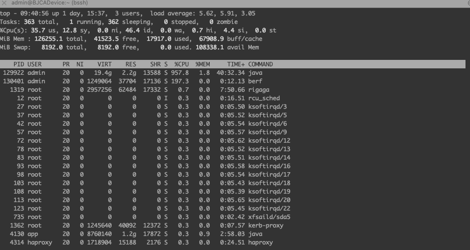
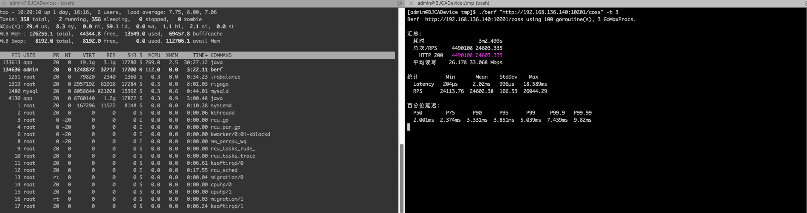
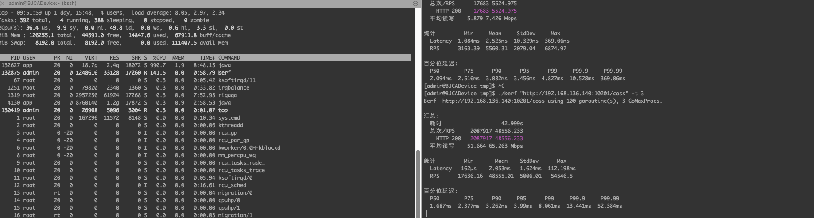
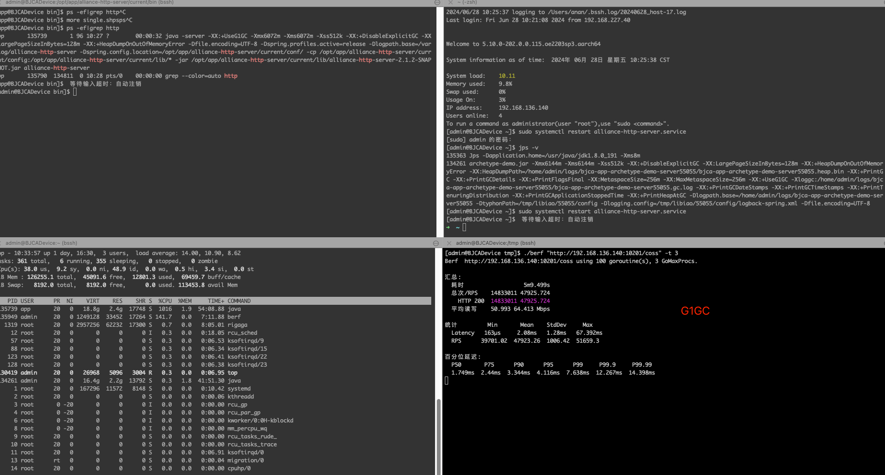

<!-- START doctoc generated TOC please keep comment here to allow auto update -->
<!-- DON'T EDIT THIS SECTION, INSTEAD RE-RUN doctoc TO UPDATE -->
**Table of Contents**  *generated with [DocToc](https://github.com/thlorenz/doctoc)*

- [鲲鹏 920 24 c 机器测试](#%E9%B2%B2%E9%B9%8F-920-24-c-%E6%9C%BA%E5%99%A8%E6%B5%8B%E8%AF%95)
    - [spring boot 空接口](#spring-boot-%E7%A9%BA%E6%8E%A5%E5%8F%A3)
    - [脚手架空接口](#%E8%84%9A%E6%89%8B%E6%9E%B6%E7%A9%BA%E6%8E%A5%E5%8F%A3)
    - [coss](#coss)
      - [coss 现状](#coss-%E7%8E%B0%E7%8A%B6)
      - [调整 JVM 参数](#%E8%B0%83%E6%95%B4-jvm-%E5%8F%82%E6%95%B0)

<!-- END doctoc generated TOC please keep comment here to allow auto update -->

# 鲲鹏 920 24 c 机器测试

结论，

1. 脚手架空接口和 spring boot 空接口性能差距极小
2. G1GC 比 CMS 效率高。在 192.158.136.140 机器 alliance-http-server 服务，修改 GC 性能提升 95+%

用于和 coss 对比

场景|GC|QPS|CPU占用|备注
---|---|---|---|---
spring boot|G1GC|7.2 W|1000%|-
脚手架空工程|G1GC|7.1 W|1000%|-
coss|CMS|2.4 W|<800%|-
coss|G1GC|4.8 W|1000%|-

### spring boot 空接口

```shell
java -server-XX:+UseG1GC-Xmx6072m-Xms6072m-Xss512k-XX:+DisableExplicitGC-XX:LargePageSizeInBytes=128m-XX:+HeapDumpOnOutOfMemoryError-Dfile.encoding=UTF-8-Dserver.port=55080-jar springboot-stone-0.0.1.jar
```

```text
[admin@BJCADevice tmp]$ ./berf "http://192.168.136.140:55080/coss" -t 3
Berf  http://192.168.136.140:55080/coss using 100 goroutine(s), 3 GoMaxProcs.

汇总:
  耗时                 2m10.999s
  总次/RPS     9519564 72668.442
    HTTP 200   9519564 72668.442
  平均读写    80.336 97.667 Mbps

统计         Min       Mean    StdDev     Max
  Latency    92µs    1.299ms   1.12ms   27.133ms
  RPS      68052.84  72657.24  1335.67  74761.88

百分位延迟:
  P50        P75      P90      P95      P99     P99.9     P99.99
  1.004ms  1.502ms  2.305ms  3.112ms  6.143ms  11.061ms  17.134ms
```



### 脚手架空接口

```shell
java -server -Xmx6144m -Xms6144m -Xss512k -XX:+DisableExplicitGC -XX:LargePageSizeInBytes=128m -XX:+HeapDumpOnOutOfMemoryError -XX:HeapDumpPath=/home/admin/logs/bjca-app-archetype-demo-server55055/bjca-app-archetype-demo-server55055.heap.bin -XX:+PrintGC -XX:+PrintGCDetails -XX:+PrintFlagsFinal -XX:MetaspaceSize=256m -XX:MaxMetaspaceSize=256m -XX:+UseG1GC -Xloggc:/home/admin/logs/bjca-app-archetype-demo-server55055/bjca-app-archetype-demo-server55055.gc.log -XX:+PrintGCDateStamps -XX:+PrintGCTimeStamps -XX:+PrintTenuringDistribution -XX:+PrintGCApplicationStoppedTime -XX:+PrintHeapAtGC -Dlogpath.base=/home/admin/logs/bjca-app-archetype-demo-server55055 -DtyphonPath=/tmp/libiao/55055/config -Dlogging.config=/tmp/libiao/55055/config/logback-spring.xml -Dfile.encoding=UTF-8 -cp /tmp/libiao/55055/config:/tmp/libiao/55055/lib/* -jar /tmp/libiao/55055/lib/archetype-demo.jar bjca-app-archetype-demo-server55055
```

```text
Berf  http://192.168.136.140:55055/ping using 100 goroutine(s), 3 GoMaxProcs.

汇总:
  耗时                   26.999s
  总次/RPS     1920356 71124.412
    HTTP 200   1920356 71124.412
  平均读写    62.020 95.596 Mbps

统计         Min       Mean    StdDev    Max
  Latency    96µs     1.4ms    990µs   21.195ms
  RPS      69317.66  71119.34  844.43  72883.8

百分位延迟:
  P50        P75      P90      P95      P99     P99.9     P99.99
  1.152ms  1.587ms  2.284ms  2.941ms  5.632ms  10.033ms  12.945ms


```

### coss

作为对比的 coss

#### coss 现状

约 2.5 W，CPU 占用小于 800%

```shell
java -server -Xmx6144m -Xms6144m -Xmn3072m -XX:PermSize=128m -Xss256k -XX:+DisableExplicitGC -XX:+UseConcMarkSweepGC -XX:+CMSParallelRemarkEnabled -XX:+UseCMSCompactAtFullCollection -XX:LargePageSizeInBytes=128m -XX:+UseFastAccessorMethods -XX:+UseCMSInitiatingOccupancyOnly -XX:CMSInitiatingOccupancyFraction=70 -Dspring.profiles.active=release -Dlogpath.base=/var/log/alliance-http-server -Dspring.config.location=/opt/app/alliance-http-server/current/conf/ -cp /opt/app/alliance-http-server/current/config:/opt/app/alliance-http-server/current/lib/* -jar /opt/app/alliance-http-server/current/lib/alliance-http-server-2.1.2-SNAPSHOT.jar alliance-http-server
```

```text
[admin@BJCADevice tmp]$ ./berf "http://192.168.136.140:10201/coss" -t 3
Berf  http://192.168.136.140:10201/coss using 100 goroutine(s), 3 GoMaxProcs.

汇总:
  耗时                 3m33.499s
  总次/RPS     5262411 24648.296
    HTTP 200   5262411 24648.296
  平均读写    26.226 33.128 Mbps

统计         Min       Mean    StdDev    Max
  Latency   204µs    1.879ms   998µs   18.589ms
  RPS      24113.76  24646.24  202.16  26044.29

百分位延迟:
  P50        P75     P90      P95      P99     P99.9   P99.99
  1.883ms  2.276ms  3.19ms  3.756ms  4.907ms  7.196ms  9.487ms
```



#### 调整 JVM 参数

使用 G1GC 可以达到 4.8 W，和 spring boot 1.5.x 默认差 2.4 ~ 2.7 W

```shell
java -server -XX:+UseG1GC -Xmx6072m -Xms6072m -Xss512k -XX:+DisableExplicitGC -XX:LargePageSizeInBytes=128m -XX:+HeapDumpOnOutOfMemoryError -Dfile.encoding=UTF-8 -Dspring.profiles.active=release -Dlogpath.base=/var/log/alliance-http-server -Dspring.config.location=/opt/app/alliance-http-server/current/conf/ -cp /opt/app/alliance-http-server/current/config:/opt/app/alliance-http-server/current/lib/* -jar /opt/app/alliance-http-server/current/lib/alliance-http-server-2.1.2-SNAPSHOT.jar alliance-http-server
```

```text
[admin@BJCADevice tmp]$ ./berf "http://192.168.136.140:10201/coss" -t 3
Berf  http://192.168.136.140:10201/coss using 100 goroutine(s), 3 GoMaxProcs.

汇总:
  耗时                11m18.716s
  总次/RPS    32842472 48389.097
    HTTP 200  32842472 48389.097
  平均读写    51.486 65.035 Mbps

统计         Min      Mean    StdDev      Max
  Latency   152µs    2.06ms   1.313ms  112.198ms
  RPS      17636.16  48388.8  1491.08   54546.5

百分位延迟:
  P50        P75      P90      P95      P99     P99.9     P99.99
  1.723ms  2.417ms  3.299ms  4.034ms  8.061ms  12.429ms  14.811ms
  
  
[admin@BJCADevice tmp]$ ./berf "http://192.168.136.140:10201/coss" -t 3
Berf  http://192.168.136.140:10201/coss using 100 goroutine(s), 3 GoMaxProcs.

汇总:
  耗时                  9m2.326s
  总次/RPS    25996944 47935.926
    HTTP 200  25996944 47935.926
  平均读写    51.004 64.426 Mbps

统计         Min      Mean    StdDev     Max
  Latency   161µs    2.08ms   1.287ms  67.392ms
  RPS      39701.02  47935.2  895.18   51659.3

百分位延迟:
  P50       P75      P90      P95      P99     P99.9     P99.99
  1.737ms  2.44ms  3.358ms  4.116ms  7.638ms  12.267ms  14.065ms
[admin@BJCADevice tmp]$
```




